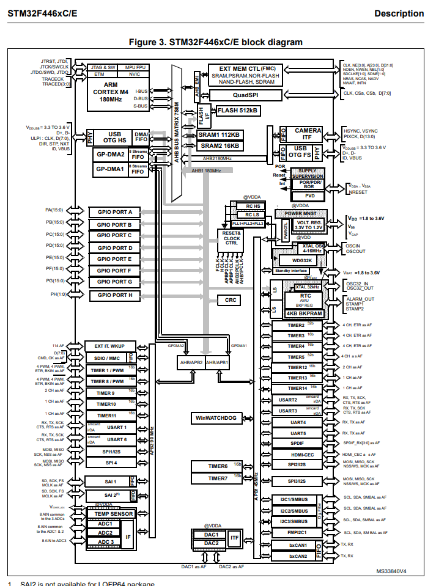
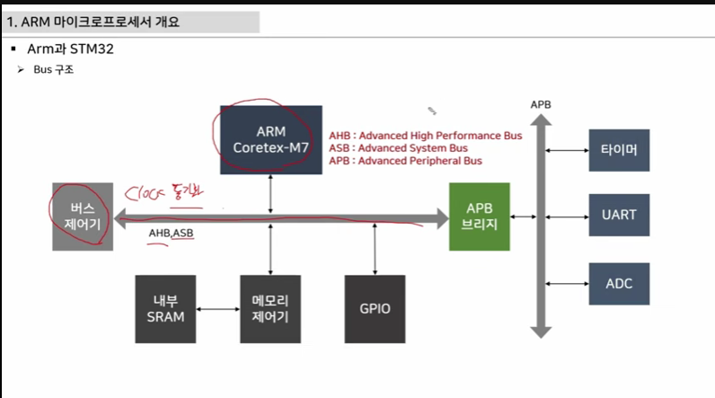

# 3강 심화 개념 학습(foam예시)
오늘 배우는 이 공식은 지난 [[Lec1_개요]]에서 배웠던 기본 법칙을 바탕으로 합니다. 
더 자세한 실습 코드는 [[Lec2_실습]]을 참고하세요.

# ARM 마이크로 프로세서 개요
MCU는 CPU의 디지털신호/PWM/통신과 같이 임베디드에서 사용되는 주변장치(PHERIPHERAL)을 연결해 하나의 칩으로 제작된 형태
CPU는 주변장치와 데이터를 주고 받으며 이를 버스라고 부름 (GPIO RAN TIMERCOUNTER UART JTAG NVIC ADC CLOCK ADC I2C)
ARM회사는 MCU코어만 만들고 ST회사에서는 주변장치를 모두 포함한 MCU장치를 판매

# CORTEX종류와 용도
CORTEX-R:실시간 프로세싱을 위한 고성능 임베디드 프로세서(MULTI MCU처리)
CORTEX-M:MCU기반 임베디드
선택한 모델: CORETEX-M4모델
어떤 모델을 선택하면 DATASHEET와 REFERENCE MANUAL을 읽을 줄 알아야함.

#BLOCK DIAGRAM

ARM CORTEX에는 AHB/ASB라고 불리우슨 버스제어기(CLOCK동기화)로 
내부 SRAM메모리 제어기 GPIO등등이 APB브리지에 연결되어 AHB에는 타이머/UART/ADC가 들어가있음
엄밀히는 메모리 제어기,내부SRAM을 제외하고는 GPIO도 포함해서 PERIPHERAL

#F446RE의 칩페키지 사양 /포트 사양/ 레지스터 설정
1. 레지스터: 
-CONTROL REGISTER(속도, 인터럽트 설정):레퍼런스 매뉴얼로 참고 
-STATUS REGISTER(통신 완료 , 클럭 설정 완료, 인터럽트 발생)
-DATA REGISTER(ADC변환 데이터, 통신 데이터)

2. datasheet-reference manaul활용법:
datasheet에서 <Figure 10. STM32F446xC/xE LQFP64 pinout>를 확인 할 수 있고 여기서 
gpio를 위해 pa6(22번)을 선택하면 <Table 10. STM32F446xx pin and ball descriptions (continued)>를 통해서 pa6이 f446re에서 22번이라는걸 다시 확인할 수 있고 i/o이며 ft로 (3.3에서 5v까지 max가능)을 확인

해당 행에서 alternate functions이나 additional(adc)로 활용이 가능함.
그리고 reference manual에서 gpio port mode registers를 찾아서 

3. Memory Address(Reference Manual : 2.2.2절)
-0x0000 0000 ~ 0xFFFF FFFF 전체 중 pheripheral은 0x4000 0000에서 부터 시작하고 
-APB1버스 영역(저속), AHB1(0x4002 0000)중에 AHB고속을 우선 사용함
-resister map에서 gpioa_base: 0x4002 0000, RCC_BASE: 0x4002 3800(클록 제어기)
*우선 페리페랄을 다 꺼둬서 전력소비를 줄임. RCC를 부름으로써 타이머를 키고
-PORT A부터 PORT H까지는 

예시 코드(순수 베어메탈)
#define RCC_BASE //0x40023880 RCC블록 시작
#define GPIOA_BASE //0x40020000 PortA시작 

#define RCC_AHB1ENR (*(volatile unsigned int*)RCC_BASE + 0x30)
#define GPIOA_MODER (*(volatile unsinged int*)(GPIOA_BASE + 0x00))

//1단계 클럭을 깨워서 reset 하기
RCC_AHB11ENR |= (1<<0);
GPOIA_MODER &= ~(3 << (6*2));

//2단계 의도한 모드(예:일반 목적 출력 코드:01)로 설정
GPIOA_MODER |= (1 << (6*2));

이걸 STM32 CUBEMX로 설정을 함녀 
예시코드(CUBE MX 도움 베어메탈)
void MX_GPIO_Init(void)
{
  GPIO_InitTypeDef GPIO_InitStruct = {0};

  /* 1단계: RCC 클록 활성화 (수동으로 RCC_AHB1ENR |= (1<<0) 하던 작업을 대신 해줍니다) */
  __HAL_RCC_GPIOA_CLK_ENABLE();

  /* 2단계: PA6 핀의 모드 설정 (출력 모드, 푸시풀 등 설정) */
  GPIO_InitStruct.Pin = GPIO_PIN_6;
  GPIO_InitStruct.Mode = GPIO_MODE_OUTPUT_PP; // 일반 목적 출력 모드 (수동으로 MODER에 01 넣던 것)
  GPIO_InitStruct.Pull = GPIO_NOPULL;
  GPIO_InitStruct.Speed = GPIO_SPEED_FREQ_LOW;
  HAL_GPIO_Init(GPIOA, &GPIO_InitStruct);
}//SETTING값을 넣으면 이런식으로 바뀌어나옴

4. cortex-debug tool은 왜이렇게 variation이 많을까?
-회사마다 혹은 칩종류 마다 본인들의 디버깅을 위해서

5. stm32에서 cube를 쓰지않고 베어메탈을 한다면 왜 linker와 같은 개념을 알아야할까?
-코드가 실행되기까지 컴파일(.c)->링커(.o)->elf을 거침
-